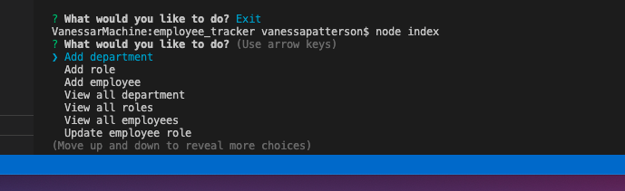

# employee_tracker
Project Name: Employee Tracker

# Description:
Create an interface for managing a company's employees using node, inquirer, and MySQl, also known as a Content Management System. This interface will help a user view and manage company departments, roles and employees to further organize and plan the user's business. 

# How to Use:

This application is a command line interface. The user will open the index.js file in integrated terminal. Assuming all packages have been installed, the user will enter node index to start the application. The user will be prompted to select from the list an action to complete. Using the up and down keyboard arrows, the user can pick an action by hitting enter. Depending on what is selected, the user will be further prompted accordingly. Please see the video demonstrating the entirety of the application's functionality.

# Link to deployed application:

https://vpatt1031.github.io/employee_tracker/

# Link to video of application's functionality:

